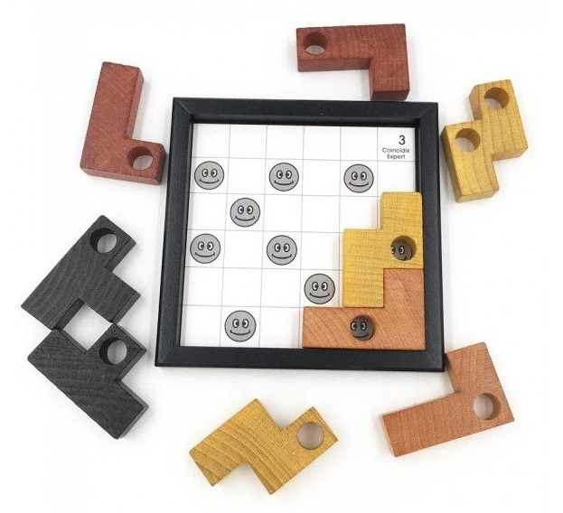
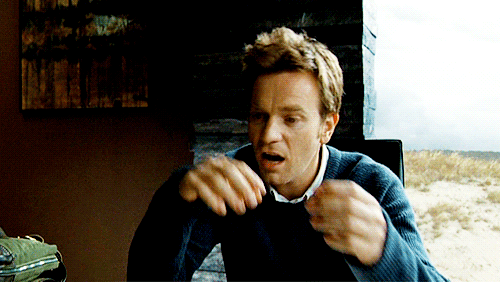
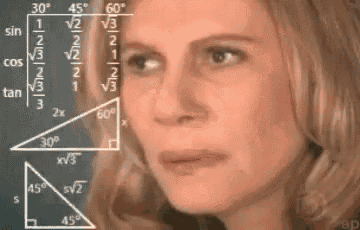

# Coincidix Puzzle Solver - A journey through my first python project 
## Prelude
In October 2020 my roomate came back from visiting his family with a hand-made wooden puzzle, as a big fan of logical game I immediatly gave it a shot. 

The rules are very simple :

* Pick a grid and put in on the board *(1 to 38 in ascending difficulty)*

* Put each piece on the board

* Each hole must be facing a smiley face

**Looks easy right ?** well after a solid two hours we were stumped, we didn't even clear the first grid supposed to be the easier one. Four grown man defeated by a game designed for teenagers, you can imagine our frustration ...

## Coding Time

As I had recently started taking Python course as part of a **career change** reorienting from mechanical engineering **to software/web development** so I thought to myself :
>You know what if we can't beat this game the normal way I'm sure I can get the solution numerically !

And thus began **my first python project** , for the first version I set my mind to use only basic python function, no libraries allowed , and to improve the code as I progress through my courses ! *(I'm quite sure using numpy would have made the whole exercise easier)*

As I was not entirely sure of how to proceed I started coding the easy parts to get in the flow :
* Create the list of coordinates of all smileys for the first grid
* Create all shapes *three square localized relatively with the hole*
* Create all shapes orientations *eight orientation for each piece*

At first I was trying to build a recursive function to put the different pieces on the board one-by-one but I quickly came to the realization that this problem could more easily be broken down as a combination problem. Each piece could only be in certain **states** characterize by two numbers : the piece **position** i.e the smiley the shape hole occupy, **ranging from 0 to 9**, and the piece orientation **ranging from 0 to 7**. Each piece states could then be combined to form a full board state. After brushing up a bit on the mathematical concepts I had a plan.

1. Determine all realistic states for each piece *all pieces have 80 different possible states*
    * Remove all states that have pieces square outside of the board
    * Remove all states that have pieces square covering a smiley
2. Create the full combination tree from pieces states
3. Remove all unrealistic board states 
    * Remove all states that have piece clashing with each other
    * Check that the S-shaped piece with two holes have both holes over a smiley
4. Print the board for the working 

First part went smoothly, I was able to reduce the possible states for each piece to their realistic one, checking the output of my code with the puzzle. I then confidently coded the loop to create the full combination tree and pressed Run ... my RAM usage quickly went through the roof and a quick google search for *"how to stop a python script"* was required ! Then it hit me, the number of possible combination was way too high.

Even after reducing the pieces possible states from 80 to an average of 20, I still had 9 pieces to combine which mean around 500 billions possibility for combined states. **I had to be smarter !**

I decided to check the validity of the combined state as it was created , each time a piece is added the filter function is called using a mask based on my function checking for clash between pieces.

This time I've carefully run the code adding one pieces at a time and displaying the number of combined state :
* One piece : 14 states
* Two pieces : 152 states
* Three pieces : 1658 states
* Four pieces: 11 200 states

The number of states are increasing fast but there is still room on the board,thus pieces should not clash between them that much, at some point adding pieces should start to decrease the number of possible states ...
* Five pieces : 19 192 states
* Six pieces : 13160 states
* Seven pieces : 1886 states

Alright we are getting there the solution to the puzzle is only two pieces away...
* Eight pieces : 120 states
* Nine pieces : 0 state

Something had to be wrong with my code ...

## Debug Time

I first tried to run different grid through my algorithm without any luck. I then decided to code function to print single piece orientation and full board state allowing me to have a more visual approach of what was happening.

I quickly discovered several issues :
*  I had messed up the definition of a L-shaped piece at the beginning of my code
* The two hole S-shaped had valid state removed at its creation as I was considering the second hole as a plain square
* The two hole S-shaped piece needed to be considered twice, one run for each hole considered as the origin

Fixing all thoses issues I was entirely sure that now the algorithm would work and we would finally have the answer to this puzzle.
>Note that at this point , four days had gone since our first attempt to solve the puzzle and still, nobody had manage to find a a solution.

I run the code with all the confidence in the world and : **0 state possible**

It was starting to get annoying but I got an idea. I needed to be sure that the puzzle was solvable, it makes no sense that somebody would sell an unsolvable puzzle but I still needed to be sure. I then decided to build a square with the pieces without a grid, and to then derive the grid from this state effectively giving me a problem with a **known solution.**

I run this input through my algorithm and to my surprise it gives me four different possible configuration, one of which is the one I had created. Damn this algorithm seems to work ... I thought to myself 
>This is weird, maybe I am biased somehow, I should have somebody else creating solutions ...

I then tasked my roomates to produce more square without bothering with a grid and each time they did, the algorithm was able to find the correct solution...

 I could not resolve myself to think that the editors of the puzzle messed up this bad, I've checked and re-checked the rules to be sure that there wasn't something we had left out and then decided to spend one last day trying to understand what was going on.
 
  I could not find everything wrong with my code, I had validated each function, dissected everything that I could, I've started running grids through my algorithm, over the thirteen grids I've tried only one was solved, grid #5, adding to my confusion ...

  At this moment I had already invested a lot of time this week trying to resolve this puzzle and nothing was making sense anymore, I had started to lose hope. As a last ressort I tried to find if someone was complaining about the game online or maybe posted a solution, anything that could give me a clue ... 

  ## Breakthrough

  On the first reseller website I find there is a picture of the puzzle completed for grid #1, I immediatly think that my algorithm is wrong and proceed to build the solution with my own game and that's when I realized **OUR GAME HAS WRONG PIECES !**

  

  My life is making sense again ! I run the algorithm with the correct T-piece and I can finally find the solution for every grid ! I can go to sleep I deserve it.

 
 The next day I put the finishing touch to the algorithm adding a final state validation through the second hole of the S-shaped piece, and finally pushing the code to GitHub. Last but not least I've decided to redact my first readme in markdown. 

 Thanks for reading up to here ! I'm going to try to solve the puzzle without the algorithm ! ;)